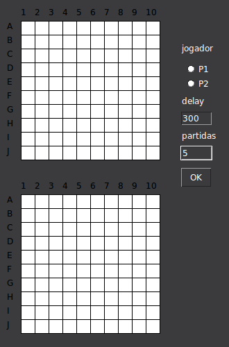

# battleship

Python programs that play the Battleship board game, plus a GUI that enables competition between them.

Algorithms include:

- random choice
- multiple greedy algos
- statistical-based approach

## Example

